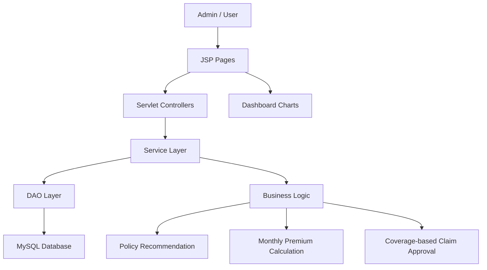
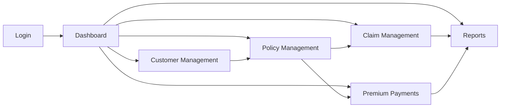
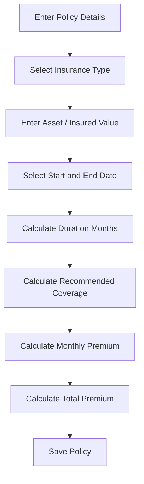
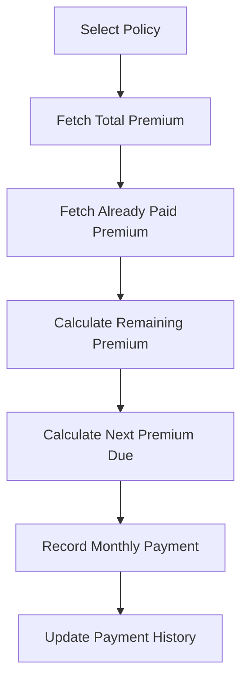
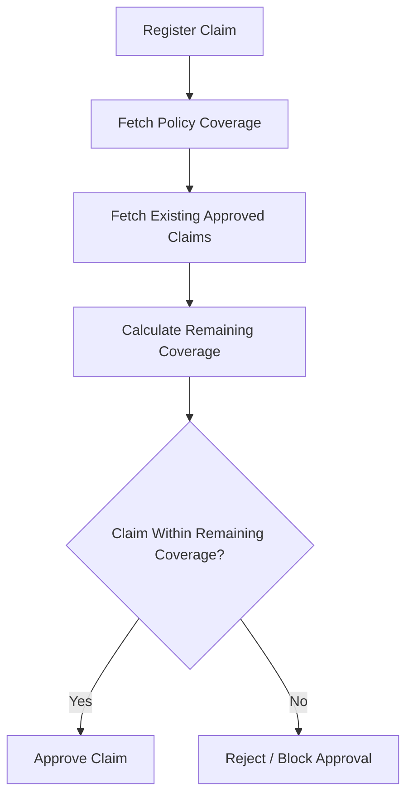

# 🛡️ Insurance Management System

<div align="center">


### A professional JSP + Servlet + JDBC + MySQL based web application for managing insurance customers, policies, claims, premium payments, and customer-wise reports.

</div>

---

## 📌 Project Overview

**Insurance Management System** is a Java web application designed to manage the complete workflow of an insurance business.  
The system allows an admin to manage customers, create recommendation-based insurance policies, calculate monthly premiums, record premium payments, handle claims, and generate professional customer-wise reports.

This project is built using:

- **JSP** for frontend pages
- **Servlets** for request handling
- **JDBC** for database connectivity
- **MySQL** for persistent storage
- **Apache Tomcat 9** for deployment
- **Maven** for project build and dependency management

---

## 🚀 Key Highlights

- Clean admin dashboard with charts and analytics
- Customer management module
- Policy recommendation system
- Monthly premium calculation
- Premium payment tracking
- Coverage-based claim approval logic
- Customer-wise printable reports
- MySQL-backed persistent storage
- Maven WAR packaging
- Tomcat 9 deployment support

---

## 🧠 Business Logic

The system follows realistic insurance rules.

### Policy Recommendation Logic

When an admin creates a policy, the system calculates the policy values automatically based on:

```text
Insurance Type + Asset / Product / Insured Value + Policy Duration
```

The system calculates:

```text
Recommended Coverage
Monthly Premium
Total Premium
Duration Months
```

### Premium Logic

Premium is treated as **monthly**.

```text
Monthly Premium = Annual Premium / 12
Total Premium = Monthly Premium × Policy Duration Months
```

Payment module records **one monthly premium payment at a time**.

```text
Next Premium Due = min(Monthly Premium, Remaining Premium)
```

### Claim Logic

Claims are approved only if they are within remaining policy coverage.

```text
Existing Approved Claims + Current Claim Amount <= Policy Coverage Amount
```

This prevents invalid approvals where claim payout exceeds policy coverage.

---

## 📊 Dashboard Features

The dashboard provides a clean analytics-style overview.

### Dashboard includes:

- Total customers
- Active policies
- Premium collected
- Pending claims
- Premium collection trend graph
- Policy type distribution chart
- Claim status overview chart
- Premium paid vs remaining progress
- Recent premium payments
- Quick action shortcuts

---

## 🧩 Modules

### 1. Admin Authentication

Secure admin login system.

```text
Default Username: admin
Default Password: admin123
```

---

### 2. Customer Management

Admin can:

- Add customers
- View customer list
- Edit customer details
- Delete customers
- Search customer records

Customer details include:

- Full name
- Email
- Phone
- Date of birth
- Gender
- Address

---

### 3. Policy Management

Admin can create insurance policies using automatic recommendation logic.

Policy details include:

- Customer
- Policy name
- Insurance type
- Asset / product value
- Recommended coverage
- Monthly premium
- Total premium
- Start date
- End date
- Duration months
- Status

Supported insurance types:

- Health
- Life
- Vehicle
- Travel
- Property

---

### 4. Claim Management

Admin can:

- Register claims
- Auto-calculate eligible claim amount
- Approve claims
- Reject claims
- Mark claims as pending
- Delete claims

Claim amount is calculated using:

```text
Eligible Claim Amount = Policy Coverage - Already Approved Claims
```

---

### 5. Premium Payment Management

Admin can:

- Record monthly premium payments
- Auto-calculate next premium due
- Track paid premium
- Track remaining premium
- View payment history

Payment amount is calculated using:

```text
Next Premium Due = min(Monthly Premium, Remaining Premium)
```

---

### 6. Reports

The system generates professional customer-wise reports.

Report includes:

- Customer information
- Financial summary
- Policy details
- Claim details
- Premium payment details
- Total asset value
- Recommended coverage
- Total premium
- Premium paid
- Remaining premium
- Approved claims
- Pending claims

Reports are designed for **A4 portrait printing**.

---

## 🏗️ System Architecture



---

## 🗂️ Project Structure

```text
InsuranceManagementSystem/
│
├── src/
│   └── main/
│       ├── java/
│       │   ├── config/
│       │   │   └── DBConnection.java
│       │   │
│       │   ├── dao/
│       │   │   ├── AdminDAO.java
│       │   │   ├── CustomerDAO.java
│       │   │   ├── PolicyDAO.java
│       │   │   ├── ClaimDAO.java
│       │   │   └── PaymentDAO.java
│       │   │
│       │   ├── model/
│       │   │   ├── Admin.java
│       │   │   ├── Customer.java
│       │   │   ├── Policy.java
│       │   │   ├── Claim.java
│       │   │   └── Payment.java
│       │   │
│       │   ├── service/
│       │   │   ├── AdminService.java
│       │   │   ├── CustomerService.java
│       │   │   ├── PolicyService.java
│       │   │   ├── ClaimService.java
│       │   │   └── PaymentService.java
│       │   │
│       │   └── servlet/
│       │       ├── LoginServlet.java
│       │       ├── LogoutServlet.java
│       │       ├── CustomerServlet.java
│       │       ├── PolicyServlet.java
│       │       ├── ClaimServlet.java
│       │       └── PaymentServlet.java
│       │
│       └── webapp/
│           ├── index.jsp
│           ├── login.jsp
│           ├── dashboard.jsp
│           ├── reports.jsp
│           ├── WEB-INF/
│           │   └── web.xml
│           │
│           ├── customers/
│           ├── policies/
│           ├── claims/
│           └── payments/
│
├── pom.xml
├── README.md
└── .gitignore
```

---

## 🗄️ Database Design

### Database Name

```sql
insurance_db
```

---

## 🧾 Main Tables

### Admins Table

```sql
CREATE TABLE admins (
    admin_id INT AUTO_INCREMENT PRIMARY KEY,
    username VARCHAR(50) NOT NULL UNIQUE,
    password VARCHAR(100) NOT NULL
);
```

### Customers Table

```sql
CREATE TABLE customers (
    customer_id INT AUTO_INCREMENT PRIMARY KEY,
    full_name VARCHAR(100) NOT NULL,
    email VARCHAR(100) NOT NULL,
    phone VARCHAR(20) NOT NULL,
    dob DATE,
    gender VARCHAR(20),
    address TEXT,
    created_at TIMESTAMP DEFAULT CURRENT_TIMESTAMP
);
```

### Policies Table

```sql
CREATE TABLE policies (
    policy_id INT AUTO_INCREMENT PRIMARY KEY,
    customer_id INT NOT NULL,
    policy_name VARCHAR(100) NOT NULL,
    policy_type VARCHAR(50) NOT NULL,
    asset_value DECIMAL(12,2) DEFAULT 0,
    premium_amount DECIMAL(12,2) NOT NULL,
    monthly_premium DECIMAL(10,2) DEFAULT 0,
    coverage_amount DECIMAL(12,2) NOT NULL,
    start_date DATE NOT NULL,
    end_date DATE NOT NULL,
    duration_months INT DEFAULT 12,
    status VARCHAR(30) NOT NULL,
    recommendation_note VARCHAR(255),
    created_at TIMESTAMP DEFAULT CURRENT_TIMESTAMP,
    FOREIGN KEY (customer_id) REFERENCES customers(customer_id)
);
```

### Claims Table

```sql
CREATE TABLE claims (
    claim_id INT AUTO_INCREMENT PRIMARY KEY,
    policy_id INT NOT NULL,
    claim_amount DECIMAL(12,2) NOT NULL,
    claim_reason TEXT NOT NULL,
    claim_date DATE NOT NULL,
    status VARCHAR(30) NOT NULL,
    created_at TIMESTAMP DEFAULT CURRENT_TIMESTAMP,
    FOREIGN KEY (policy_id) REFERENCES policies(policy_id)
);
```

### Payments Table

```sql
CREATE TABLE payments (
    payment_id INT AUTO_INCREMENT PRIMARY KEY,
    policy_id INT NOT NULL,
    amount DECIMAL(12,2) NOT NULL,
    payment_date DATE NOT NULL,
    payment_mode VARCHAR(50) NOT NULL,
    status VARCHAR(30) NOT NULL,
    created_at TIMESTAMP DEFAULT CURRENT_TIMESTAMP,
    FOREIGN KEY (policy_id) REFERENCES policies(policy_id)
);
```

---

## 🔁 Application Flow



---

## 📈 Policy Calculation Flow



---

## 💰 Premium Payment Flow



---

## 🧾 Claim Approval Flow



---

## 🛠️ Tech Stack

| Layer | Technology |
|---|---|
| Frontend | JSP, HTML, CSS, JavaScript |
| Backend | Java Servlet |
| Business Logic | Java Service Layer |
| Database Access | JDBC |
| Database | MySQL |
| Server | Apache Tomcat 9 |
| Build Tool | Maven |
| IDE | IntelliJ IDEA |
| Charts | Chart.js |

---

## ⚙️ Setup Instructions

### 1. Clone Repository

```bash
git clone https://github.com/Ashurarex/Insurance-Management-System.git
cd Insurance-Management-System
```

---

### 2. Open Project in IntelliJ IDEA

Open the folder as a Maven project.

Make sure JDK is set to:

```text
Java 17
```

---

### 3. Configure MySQL

Create database:

```sql
CREATE DATABASE insurance_db;
USE insurance_db;
```

Create the required tables using the SQL schema given above.

Insert default admin:

```sql
INSERT INTO admins (username, password)
VALUES ('admin', 'admin123');
```

---

### 4. Configure Database Connection

Update your database credentials in:

```text
src/main/java/config/DBConnection.java
```

Example:

```java
private static final String URL = "jdbc:mysql://127.0.0.1:3306/insurance_db?useSSL=false&serverTimezone=UTC&allowPublicKeyRetrieval=true";
private static final String USERNAME = "root";
private static final String PASSWORD = "your_mysql_password";
```

---

### 5. Build Project

```bash
mvn clean package
```

The WAR file will be generated in:

```text
target/InsuranceManagementSystem.war
```

---

### 6. Deploy on Tomcat 9

Copy WAR file to Tomcat `webapps` folder:

```text
C:\apache-tomcat-9.0.118-windows-x64\apache-tomcat-9.0.118\webapps
```

Start Tomcat:

```bash
startup.bat
```

Open in browser:

```text
http://localhost:8080/InsuranceManagementSystem
```

---

## 🔐 Default Login

```text
Username: admin
Password: admin123
```

---

## 📷 Screenshots

Add screenshots here after uploading them to your repository.

```text
screenshots/dashboard.png
screenshots/customers.png
screenshots/policies.png
screenshots/reports.png
```

Example:

```markdown


```

---

## ✅ Completed Features

- [x] Tomcat 9 setup
- [x] Maven WAR deployment
- [x] MySQL connection
- [x] Admin login/logout
- [x] Customer CRUD
- [x] Policy CRUD
- [x] Policy recommendation system
- [x] Monthly premium calculation
- [x] Premium payment module
- [x] Claim registration
- [x] Coverage-based claim approval
- [x] Customer-wise reports
- [x] Dashboard analytics
- [x] Indian number and currency formatting
- [x] Professional UI polish

---

## 🔮 Future Enhancements

- Password hashing for admin login
- Role-based access control
- PDF export button for reports
- Email notifications for premium due
- Claim document upload
- Customer login portal
- Policy renewal reminders
- Payment receipt generation
- REST API version
- Spring Boot migration

---

## 🧪 Testing Checklist

Use this checklist before submission:

- [ ] Admin can login successfully
- [ ] Customer can be added
- [ ] Customer list displays correctly
- [ ] Policy can be created using asset value
- [ ] Monthly premium is calculated correctly
- [ ] Total premium is calculated correctly
- [ ] Payment module records monthly premium
- [ ] Remaining premium reduces after payment
- [ ] Claim amount is auto-calculated
- [ ] Claim cannot exceed remaining coverage
- [ ] Dashboard charts display correctly
- [ ] Customer report prints properly
- [ ] Logout works correctly

---

## 📚 Learning Outcomes

Through this project, the following concepts are demonstrated:

- Java web application development using JSP and Servlets
- JDBC-based database connectivity
- MySQL relational database design
- MVC-style project structure
- Maven project management
- Tomcat WAR deployment
- Session-based admin authentication
- Business logic implementation in service layer
- Dynamic dashboard creation
- Chart.js integration with JSP
- Report generation using JSP and CSS print layout

---

## 👨‍💻 Author

**Raghavendra**

GitHub: [Ashurarex](https://github.com/Ashurarex)

Repository: [Insurance Management System](https://github.com/Ashurarex/Insurance-Management-System)

---

## 📄 License

This project is created for academic learning and project submission purposes.

---

<div align="center">

### ⭐ If you like this project, consider giving it a star on GitHub.

</div>
